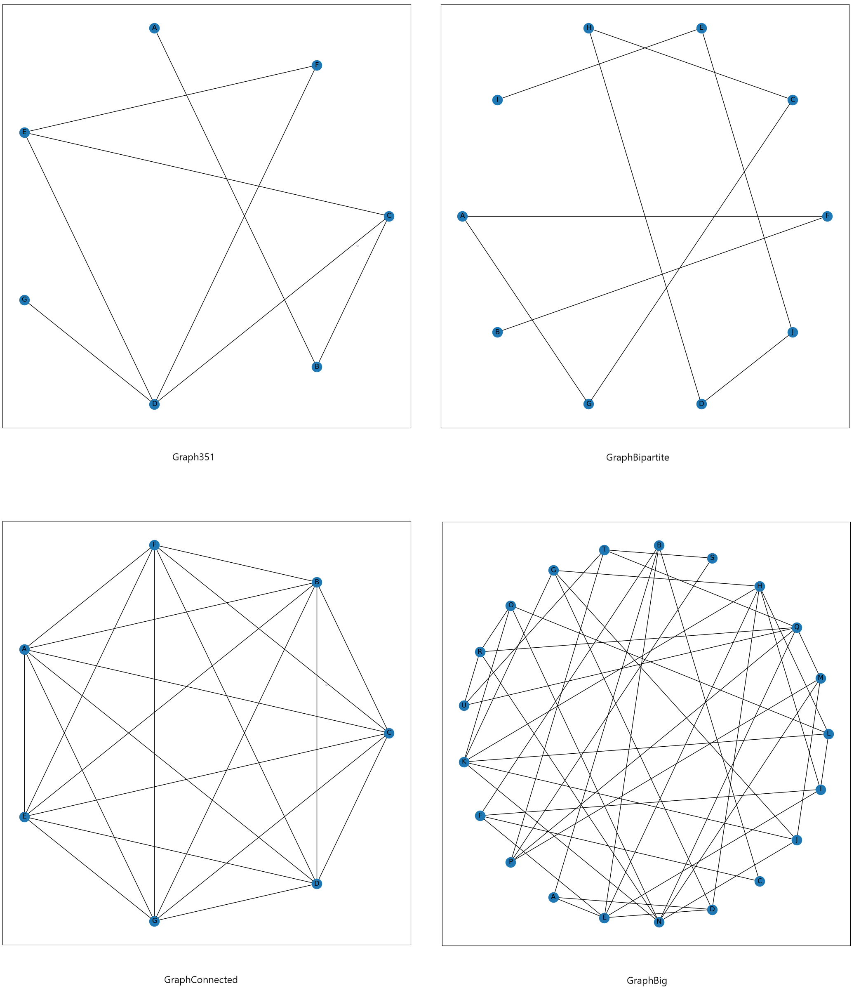
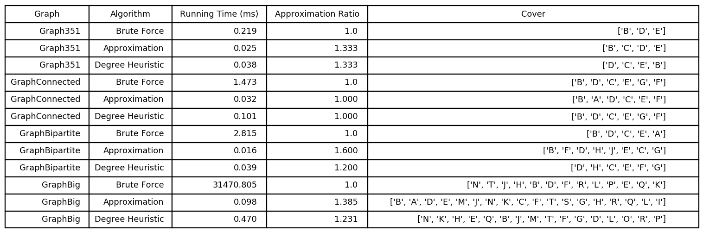
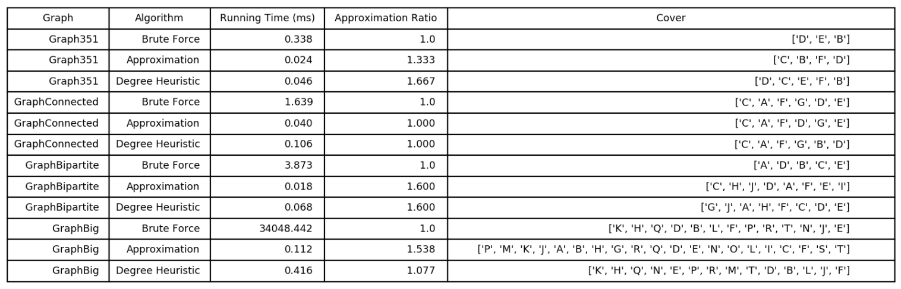
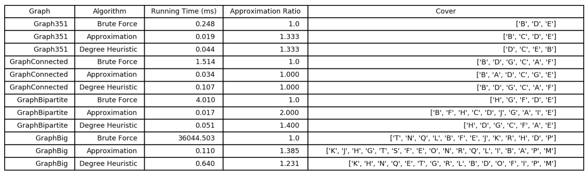
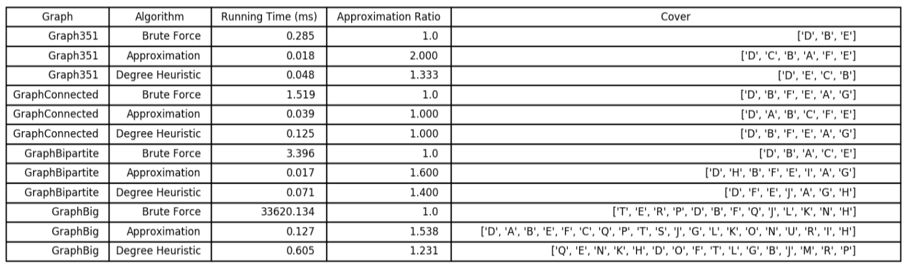
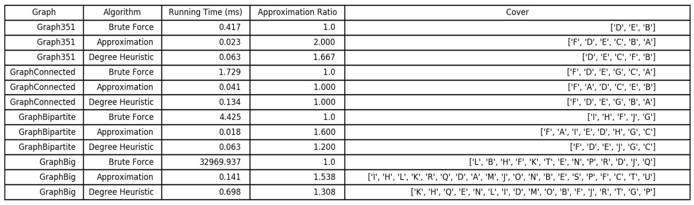
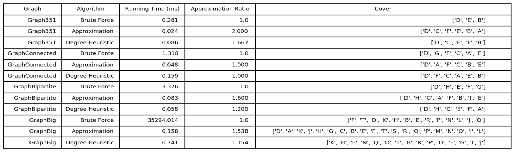

# VertexCoverSearch
This project explores algorithms for finding the minimal Vertex Cover of a graph. 

Specifically, the goal is to find the smallest value k for a graph that solves the Vertex Cover problem:  For a given graph G and integer k, determine whether or not there is a vertex cover of size k or less. 

Three algorithms to the problem implemented in Python 3.5: 
1. A brute force approach: subsets of a graph are generated from size 1 to |G.V|-1 one at a time with the first valid cover found taken as the minimal cover. 
2. A  2-approximation algorithm (APPROX-VERTEX-COVER algorithm found in Introduction to Algorithms, Third Edition by Cormen et al.)
3. A novel approximation algorithm based on the observation that the higher the degree of a vertex in a graph, the more likely it is to be in the minimal cover. This algorithm takes a graph and first generates a dictionary of (vertex,degree) for each vertex in the graph. They are not indexed by a range of values but rather by a set of immutable keys such as strings. This dictionary is then sorted so the vertices with the highest degree are near the front of the dictionary. Then, after an empty cover is created, a vertex is added to the cover and it is checked to see if it is a minimal vertex cover for the graph. If not then the next vertex in the dictionary is added. This process continues until a minimal vertex cover is found. 

## Results
In implementing the algorithms described above for solving the vertex cover problem, the
following software and hardware was used:
- Operating System: Windows 10
- Programming Language: Python 3.5
- IDE: PyCharm 2020.1
    - no specific features of PyCharm are required to run the included script
- Third party libraries:
    - matplotlib and networkx for plotting graphs and results table
    - timeit for timing execution time of algorithms
- CPU: AMD Ryzen 2600X 6 core processor
- Memory: 32 GB DDR4
- storage: SSD

### Trials
**Trial 1:**

**Trial 2:**

**Trial 3:**

**Trial 4:**

**Trial 5:**

**Trial 6:**

See the ExploringMethodsToFindApproximatelyMinimalVertexCover.pdf for a detailed description of these results and the algorithms that generated them. 
